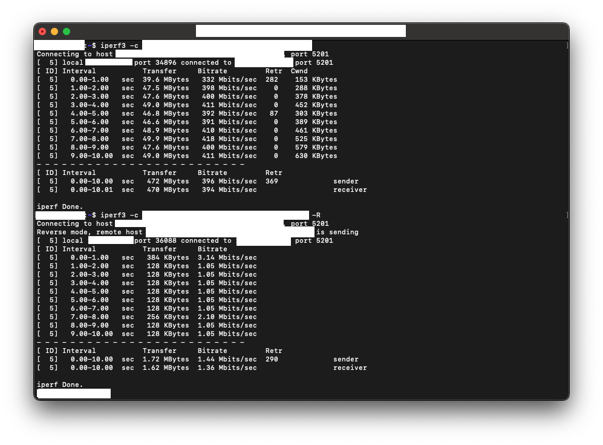
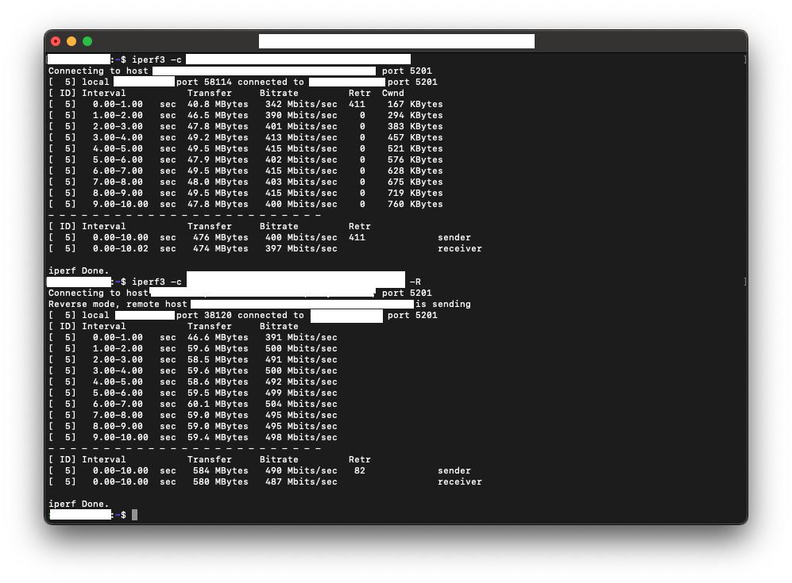

# thak1411/tailscale

TCP Segmentation Offload (TSO) 관련 문제를 해결한 Tailscale Docker 이미지입니다.  
이 이미지는 공식 Tailscale Docker 이미지를 기반으로 하며, 특정 환경에서 네트워크 성능에 영향을 줄 수 있는 TSO 관련 문제를 해결합니다.

---

Patched Tailscale Docker image with ethtool to toggle TCP Segmentation Offload (TSO) on the Tailscale network interface.  
This image is based on the official Tailscale Docker image and solves issues related to TSO that can affect network performance in certain environments.

## What is the issue?

[Similar Issue](https://github.com/tailscale/tailscale/issues/16198)

`tailscale-operator`를 사용해 Kubernetes 클러스터에서 Tailscale을 사용했을 때, TSO로 인해 네트워크 성능이 저하되는 문제가 발생할 수 있습니다. 이 현상이 발생하는 이유는 mtu때문입니다.  
대부분 mtu는 1500 혹은 그 이상의 값으로 설정되지만, Tailscale은 기본적으로 ip패킷을 한 번 더 감싼 구조이므로 1480 혹은 1460 정도로 mtu를 설정해야 합니다. 하지만 여러 변수 때문에 mtu를 넉넉하게 1280 정도로 낮게 설정해서 사용하는게 기본 값입니다. 이 과정에서 보통 pmtu값이 1280 혹은 그 이하로 설정되어 잘 작동하는게 원래 의도이지만, TSO가 활성화된 상태에서는 이보다 더 큰 패킷을 전송하려고 시도하면서 패킷 드랍이 발생하게 됩니다. 이 과정에서 네트워크 성능이 수십 수백배 저하되는 현상이 발생했습니다.

---

When using Tailscale in a Kubernetes cluster with `tailscale-operator`, network performance may degrade due to TSO. The root cause is related to MTU settings.  
Typically, MTU is set to 1500 or higher, but since Tailscale encapsulates IP packets, it should be set to around 1480 or 1460. However, due to various factors, it is common to set MTU lower, around 1280. In this process, the default PMTU is set to 1280 or lower, which works as intended. However, with TSO enabled, attempts to send larger packets can lead to packet drops, resulting in significant network performance degradation.

## How to test it?

You can test the network performance using `iperf3` between a client and server. follow the steps below:

1. deploy the `iperf3-server` in your Kubernetes cluster with given helm chart.
2. install `iperf3` in your client machine.
3. run the `iperf3` test from client to server with the command below:

```bash
sudo apt update
sudo apt install iperf3 # install iperf3 if you don't have it yet

iperf3 -c <IPERF3_SERVER_TAILSCALE_IP> # upload test
iperf3 -c <IPERF3_SERVER_TAILSCALE_IP> -R # download test
```

Then you can get this results:



The first one (upload test) shows around 400Mbps, and the second one (download test) shows around 1.5Mbps, which is a significant difference.

## How to use this image?

패치된 이미지를 사용하려면, Tailscale 배포 이미지 소스를 `ghcr.io/thak1411/tailscale:<tag>`로 교체하면 됩니다.

제 경우에는 `tailscale-operator`의 헬름 차트를 사용해 Kubernetes 클러스터에 Tailscale을 배포했기 때문에, `values.yaml` 파일에서 이미지 값을 아래와 같이 변경했습니다:

---

Just replace the image source of your Tailscale deployment to `ghcr.io/thak1411/tailscale:<tag>`.

In my case. i used `tailscale-operator`'s helm chart to deploy Tailscale in my Kubernetes cluster. so I just changed the image value in the `values.yaml` file like below:

```yaml
image:
  repository: ghcr.io/thak1411/tailscale
  tag: v1.90.9
```

## Results

패치된 이미지를 사용한 후, 동일한 `iperf3` 테스트를 수행했을 때 다음과 같은 결과를 얻었습니다:

---

After using the patched image, I performed the same `iperf3` test and got the following results:



Both upload and download tests show more than 400Mbps, indicating that the network performance issue has been resolved.

## How to build this image?

You can build this image by cloning this repository and running the following command in the directory containing the `Dockerfile`:

```bash
docker buildx build --platform linux/x86_64 -t ghcr.io/thak1411/tailscale:<tag> .
docker buildx build --platform linux/x86_64,linux/arm64 -t ghcr.io/thak1411/tailscale:<tag> . # for multi-arch build
```

## My environment

- OS: Ubuntu 24.04.3 LTS (GNU/Linux 6.8.0-88-generic x86_64)
- Kubernetes: v1.33.5
- CNI: Cilium 1.18.4
- Tailscale: v1.90.9
- Client & Server is in the same local network
